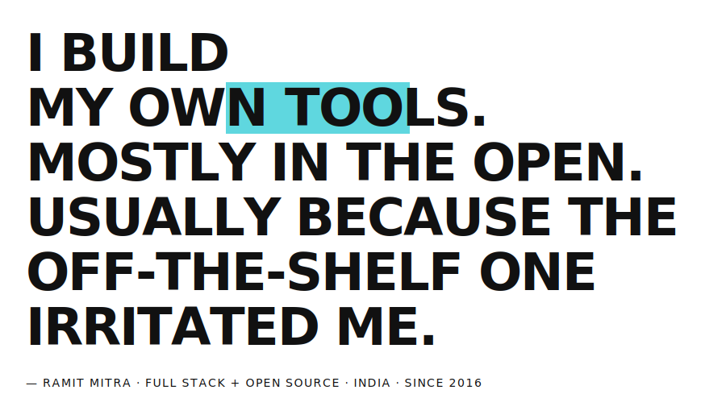
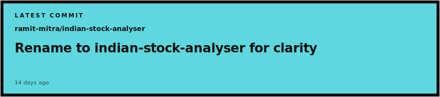

<picture>
  <source media="(prefers-color-scheme: dark)" srcset="assets/manifesto-dark.svg">
  
</picture>

---

<picture>
  <source media="(prefers-color-scheme: dark)" srcset="assets/latest-dark.svg">
  
</picture>

### `// CURRENT OBSESSIONS`

**01 · [RAMIT](https://github.com/ramit-mitra/ramit) `(TS)` — BUILDING**
An AI coding agent — minimalist, extensible, multi-model.

**02 · [ARYA](https://github.com/ramit-mitra/arya) `(GO)` — BUILDING**
An orchestration service — built for my own workflow first.

**03 · [INDIAN-STOCK-ANALYSER](https://github.com/ramit-mitra/indian-stock-analyser) — SHIPPING**
A Claude skill for deep, source-backed analysis of Indian listed stocks.

---

[ **GITHUB** ](https://github.com/ramit-mitra) · [ **X / @RAMIT\_MITRA** ](https://x.com/ramit_mitra)
